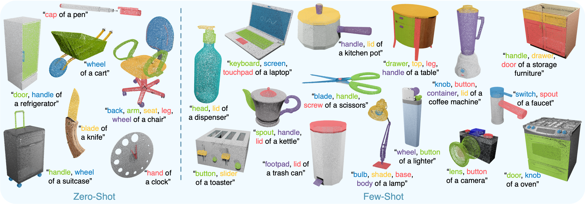
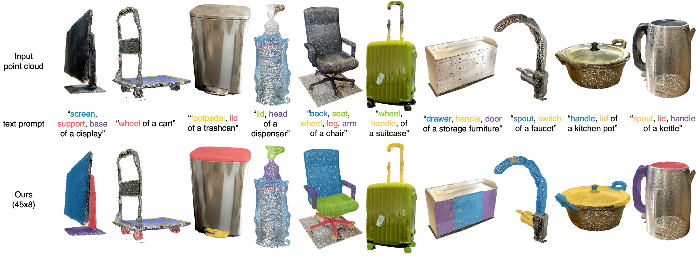

# PartSLIP
official implementation of "PartSLIP: Low-Shot Part Segmentation for 3D Point Clouds via Pretrained Image-Language Models" (CVPR2023) [[PDF](https://arxiv.org/pdf/2212.01558.pdf)]

We explores a novel way for low-shot part segmentation of 3D point clouds by leveraging a pretrained image-language model (GLIP). We show that our method enables excellent zero-shot 3D part segmentation. Our few-shot version not only outperforms existing few-shot approaches by a large margin but also achieves highly competitive results compared to the fully supervised counterpart. Furthermore, we demonstrate that our method can be directly applied to iPhone-scanned point clouds without significant domain gaps.


<p align="center">

results on PartNetE dataset
</p>

<p align="center">

results on iPhone-scanned real point clouds
</p>


**We are currently working on making the code available and will update you shortly. Please stay tuned!**

## Citation

If you find our code helpful, please cite our paper:

```
@article{liu2022partslip,
  title={PartSLIP: Low-Shot Part Segmentation for 3D Point Clouds via Pretrained Image-Language Models},
  author={Liu, Minghua and Zhu, Yinhao and Cai, Hong and Han, Shizhong and Ling, Zhan and Porikli, Fatih and Su, Hao},
  journal={arXiv preprint arXiv:2212.01558},
  year={2022}
}
```
